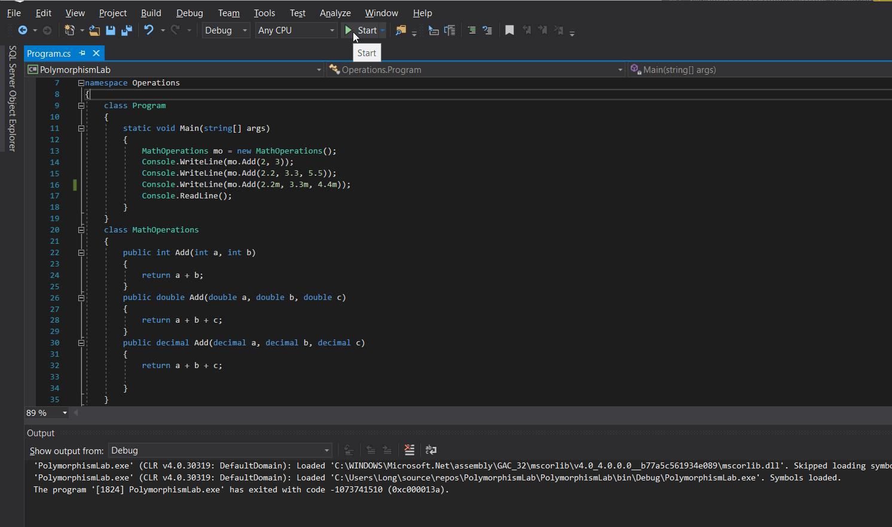
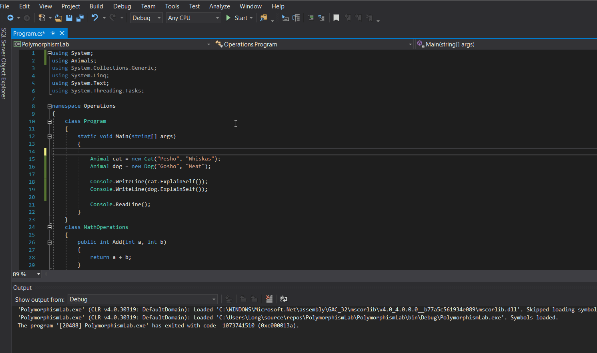

# Polymorphismlab
## MathOperation
Create a class MathOperations, which should have 3 times method Add(). Method Add() has to be invoked with: 
•	Add(int, int): int 
•	Add(double, double, double): double 
•	Add(decimal, decimal, decimal): decimal 
Result

## Animals
Create a class Animal, which holds two fields: 
•	name: string 
•	favouriteFood: string 
Animal has one virtual method ExplainSelf(): string. 
You should add two new classes - Cat and Dog. Override the ExplainSelf() method by adding concrete animal sound on a new line. (Look at examples below)  
Result 

